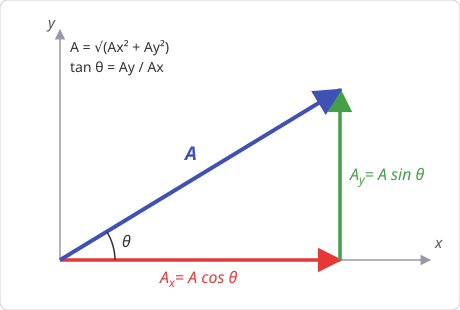
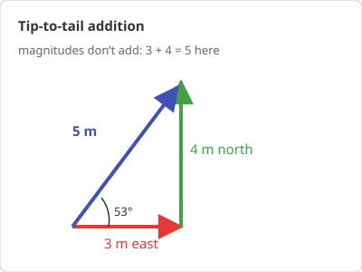

# Chapter 2 — Vectors

*Needs from earlier chapters: units (Ch. 1). Needs from maths: basic
trigonometry (sin, cos, tan) and Pythagoras.*

## 2.1 Scalars vs vectors

- **Scalar**: a quantity with magnitude only — mass, time, temperature, energy,
  speed.
- **Vector**: magnitude *and* direction — displacement, velocity, acceleration,
  force, momentum.

"Speed 50 km/h" is a scalar; "velocity 50 km/h heading north" is a vector. The
distinction matters because vectors add geometrically, not arithmetically:
walking 3 m east then 4 m north puts you 5 m from the start, not 7 m.

## 2.2 Components — the workhorse technique

Any 2D vector **A** can be split along x and y axes:

    Aₓ = A cos θ        A_y = A sin θ

where θ is measured from the +x axis and A is the magnitude. Going back:

    A = √(Aₓ² + A_y²)        θ = tan⁻¹(A_y / Aₓ)

(watch the quadrant on tan⁻¹ — if Aₓ < 0 add 180°).

{ style="max-width:460px" }

**Why components matter:** vector equations split into independent scalar
equations, one per axis. Almost every mechanics problem is solved by
"resolve into components, treat each axis separately."

**Worked example.** A rope pulls a crate with 100 N at 30° above horizontal.
Horizontal component: 100 cos 30° ≈ 86.6 N (this does the pulling).
Vertical component: 100 sin 30° = 50 N (this partly lifts the crate).

## 2.3 Adding and subtracting vectors

Add component-wise:

    C = A + B   means   Cₓ = Aₓ + Bₓ  and  C_y = A_y + B_y

Subtraction is adding the reverse: A − B = A + (−B), where −B has the same
magnitude, opposite direction.

**Worked example.** Walk 3 m east (3, 0) then 4 m north (0, 4).
Total displacement: (3, 4). Magnitude √(9+16) = 5 m, direction
tan⁻¹(4/3) ≈ 53° north of east.

{ style="max-width:400px" }

## 2.4 Multiplying vectors

**Scalar (dot) product** — result is a scalar:

    A · B = AB cos θ = AₓBₓ + A_yB_y

Measures "how much of A lies along B". Used for **work**: W = F · d.
If the vectors are perpendicular, the dot product is zero.

**Vector (cross) product** — result is a vector, magnitude:

    |A × B| = AB sin θ

direction perpendicular to both (right-hand rule: fingers sweep from A to B,
thumb gives A × B). Used for **torque** and **angular momentum**. If the
vectors are parallel, the cross product is zero.

Memory hook: dot ↔ cos ↔ "alongness"; cross ↔ sin ↔ "perpendicularness".

## 2.5 Unit vectors

x̂, ŷ, ẑ (also written î, ĵ, k̂) are vectors of length 1 along each axis.
Any vector: A = Aₓx̂ + A_yŷ + A_z ẑ. This is just component notation in
compact form.

## Common pitfalls

- Adding magnitudes when directions differ. 3 N + 4 N is only 7 N if the
  forces are parallel.
- Using sin where cos belongs. Don't memorise "x uses cos" — check which side
  of the triangle is adjacent to *your* angle. If θ is measured from the
  y-axis, the roles swap.
- Forgetting that a vector at angle θ *below* the axis has a negative
  y-component. Choose axes, fix signs, stay consistent.

## Practice problems

1. A vector has components (−5, 12). Find its magnitude and direction.
2. Forces of 6 N east and 8 N north act on an object. Find the resultant.
3. F = (10, 5) N acts on an object that moves d = (3, −2) m. Compute F · d.
4. Two displacement vectors of magnitudes 5 m and 5 m are at 60° to each
   other. What is the magnitude of their sum?

??? success "Answers"

    1. Magnitude √(25+144) = **13**. Direction: tan⁻¹(12/−5) with Aₓ<0 →
       **≈ 112.6°** from +x axis.
    2. √(36+64) = **10 N**, at tan⁻¹(8/6) ≈ **53° north of east**.
    3. 10×3 + 5×(−2) = **20 J** (dot product of force and displacement is work).
    4. C² = 5² + 5² + 2·5·5·cos 60° = 75 → **≈ 8.66 m**.

