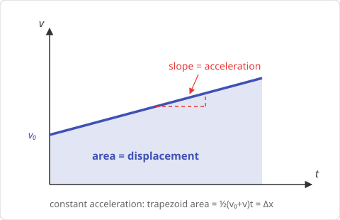
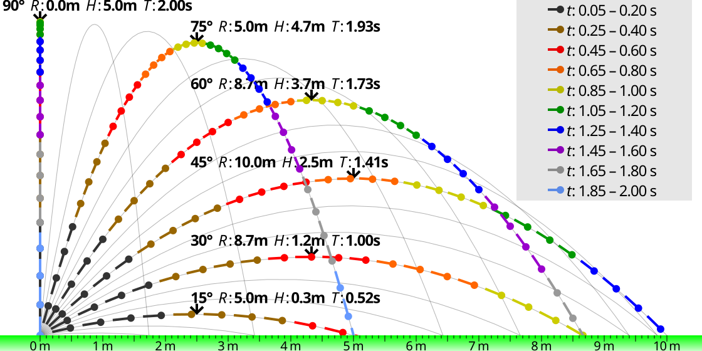

# Chapter 3 — Kinematics: Describing Motion

*Needs from earlier chapters: units (Ch. 1), vectors and components (Ch. 2).*

Kinematics describes *how* things move — position, velocity, acceleration —
without asking about forces. Forces come in Chapter 4.

## 3.1 The three central quantities

- **Position** x: where the object is (m). **Displacement** Δx = x_f − x₀ is
  the change in position — a vector, unlike distance travelled.
- **Velocity** v = Δx/Δt: rate of change of position (m/s). Instantaneous
  velocity is the slope of the x–t graph.
- **Acceleration** a = Δv/Δt: rate of change of *velocity* (m/s²). Slope of
  the v–t graph.

Key idea: acceleration is any change in the velocity *vector* — speeding up,
slowing down, or turning. A car rounding a bend at constant speed is
accelerating.

Graph literacy (worth drilling):
- Slope of x–t graph = velocity. Slope of v–t graph = acceleration.
- **Area under a v–t graph = displacement.** Area under an a–t graph = change
  in velocity.

{ style="max-width:480px" }

## 3.2 Constant acceleration — the "suvat" equations

When a is constant (free fall, braking at steady rate, etc.):

    (1) v = v₀ + at
    (2) Δx = v₀t + ½at²
    (3) v² = v₀² + 2aΔx
    (4) Δx = ½(v₀ + v)t

Each equation is missing one variable. Solving strategy: list what you know,
identify what you want, pick the equation containing exactly those.

| Equation | Missing |
|----------|---------|
| (1) | Δx |
| (2) | v |
| (3) | t |
| (4) | a |

**Worked example — braking distance.** A car at 60 km/h (16.7 m/s) brakes at
a = −6 m/s². How far until it stops?
Know: v₀ = 16.7, v = 0, a = −6. Want Δx, don't care about t → equation (3):
0 = 16.7² + 2(−6)Δx → Δx = 278/12 ≈ **23 m**. Note the v² : braking distance
scales with the *square* of speed — double the speed, quadruple the distance.
(This is exactly why speed bumps exist.)

**Worked example — crossing a speed bump zone.** A driver slows from 50 km/h
(13.9 m/s) to 15 km/h (4.2 m/s) over 40 m approaching a bump. Deceleration?
Equation (3): a = (v² − v₀²)/(2Δx) = (4.2² − 13.9²)/80 ≈ **−2.2 m/s²** —
comfortable braking (panic braking is ~−8 m/s²).

## 3.3 Free fall

Near Earth's surface, ignoring air resistance, everything falls with
a = g ≈ 9.8 m/s² downward, regardless of mass. Free fall is just the suvat
equations with a = −g (taking up as positive).

**Worked example.** Drop a stone from a 20 m bridge. Time to hit water:
Δx = ½gt² → t = √(2×20/9.8) ≈ **2.0 s**. Impact speed: v = gt ≈ **20 m/s**
(72 km/h — why falling from height is dangerous).

Useful symmetry: a projectile takes the same time up as down, and returns to
launch height at launch speed.

## 3.4 Projectile motion — 2D kinematics

The whole trick: **horizontal and vertical motions are independent.**
- Horizontal: no acceleration → x = v₀ₓ t, with v₀ₓ = v₀ cos θ.
- Vertical: free fall → y = v₀_y t − ½gt², with v₀_y = v₀ sin θ.

Time links the two axes. Standard results (launch and landing at same height):

    Time of flight: t = 2v₀ sin θ / g
    Range:          R = v₀² sin 2θ / g   (max at θ = 45°)
    Max height:     H = v₀² sin²θ / (2g)

{ style="max-width:640px" }

*Same launch speed, different angles: 45° gives maximum range; pairs like
30°/60° land at the same spot. Figure by CMG Lee,
[Wikimedia Commons](https://commons.wikimedia.org/wiki/File:Ideal_projectile_motion_for_different_angles.svg),
CC BY-SA 3.0.*

**Worked example.** Ball kicked at 20 m/s, 30° above horizontal.
t = 2×20×0.5/9.8 ≈ 2.04 s. R = 400 × sin 60° / 9.8 ≈ **35.4 m**.
H = 400 × 0.25 / 19.6 ≈ **5.1 m**.

## 3.5 Relative motion

Velocities add as vectors. If a boat does 4 m/s relative to water and the
river flows 3 m/s, the boat's ground velocity is the vector sum: pointing the
boat straight across gives ground speed √(4²+3²) = 5 m/s, angled downstream.

## Common pitfalls

- Using suvat when acceleration isn't constant. They only apply to constant a.
- Sign errors: pick a positive direction *once*, then make v, a, Δx all obey
  it. Deceleration is negative a only if motion is in the positive direction.
- Plugging km/h into formulas expecting m/s.
- In projectiles, using the full v₀ in one axis. Only the component belongs to
  each axis.

## Practice problems

1. A matatu accelerates from rest at 2.5 m/s². How fast after 8 s, and how far
   has it gone?
2. A car travelling 30 m/s brakes to rest in 5 s. Find the deceleration and
   stopping distance.
3. A stone is thrown straight up at 15 m/s. Max height? Total time in the air?
4. A ball rolls off a 1.2 m high table at 3 m/s (horizontally). How far from
   the table's edge does it land?
5. A driver at 80 km/h has 1.0 s reaction time, then brakes at −7 m/s². Total
   stopping distance?

??? success "Answers"

    1. v = 2.5×8 = **20 m/s**; Δx = ½×2.5×64 = **80 m**.
    2. a = −30/5 = **−6 m/s²**; Δx = ½(30+0)×5 = **75 m**.
    3. H = v₀²/2g = 225/19.6 ≈ **11.5 m**; t = 2v₀/g ≈ **3.06 s**.
    4. Fall time: t = √(2×1.2/9.8) ≈ 0.495 s → horizontal distance 3 × 0.495 ≈
       **1.48 m**.
    5. 80 km/h = 22.2 m/s. Reaction: 22.2 m. Braking: v²/2a = 493/14 ≈ 35.2 m.
       Total ≈ **57 m**. (At 50 km/h the same sum is ≈ 28 m — half. Speed limits
       are kinematics.)

