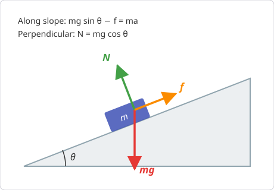
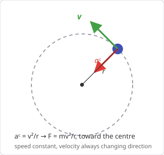

# Chapter 4 — Newton's Laws: Why Things Accelerate

*Needs from earlier chapters: vectors (Ch. 2), kinematics (Ch. 3).*

Kinematics described motion; dynamics explains it. The entire explanation is
three laws.

## 4.1 The three laws

**First law (inertia).** An object keeps constant velocity (including zero)
unless a net force acts on it. There is no force "keeping things moving" —
motion is the default; *changes* in motion need a cause.

**Second law.** The net force on an object equals mass times acceleration:

    ΣF = ma

Vector equation → one scalar equation per axis: ΣFₓ = maₓ, ΣF_y = ma_y.
Mass is the resistance to acceleration (inertia). Units: 1 N = 1 kg·m/s².

**Third law.** Forces come in pairs: if A pushes B with force F, then B pushes
A with force −F. The pair acts on *different objects*, so they never cancel
within one object's free-body diagram.

## 4.2 The standard cast of forces

| Force | Symbol | Formula / nature |
|-------|--------|------------------|
| Weight | W | W = mg, always downward |
| Normal force | N | Surface pushes perpendicular to itself; adjusts as needed |
| Tension | T | Rope pulls along its length; same magnitude throughout an ideal rope |
| Friction (static) | f_s | f_s ≤ µ_s N — matches applied force up to a maximum |
| Friction (kinetic) | f_k | f_k = µ_k N — constant while sliding, opposes sliding |
| Spring | F | F = −kx (Hooke's law; see Ch. 8) |
| Drag | F_d | Grows with speed; gives falling objects a terminal velocity |

Two things students misremember:
- **Weight vs mass.** Mass (kg) is intrinsic; weight (N) is the gravitational
  force mg. A 70 kg person weighs ≈ 686 N.
- **Normal force is not always mg.** It's whatever the surface must supply.
  On a slope it's mg cos θ; in an accelerating lift it's m(g + a).

## 4.3 Free-body diagrams — the non-negotiable skill

For each object: draw it alone, draw every force *acting on it* (not forces it
exerts on other things), choose axes (tilt them along an incline), then write
ΣF = ma per axis. Nearly all dynamics errors are free-body-diagram errors.

{ style="max-width:460px" }

**Worked example — block on an incline.** A 10 kg block on a frictionless 30°
slope. Axes along/perpendicular to slope.

    Along slope:    ΣF = ma  →  mg sin θ = ma  →  a = g sin 30° = 4.9 m/s²
    Perpendicular:  N = mg cos θ = 10 × 9.8 × cos 30° ≈ 84.9 N

**Worked example — friction.** Same block, but µ_k = 0.2.

    Friction:    f = µ_k N = 0.2 × 84.9 ≈ 17 N (up the slope)
    Along slope: ma = mg sin θ − f  →  a = 4.9 − 17/10 = 3.2 m/s²

**Worked example — will it move at all?** Push a 20 kg crate with 50 N
horizontally; µ_s = 0.3.

    Ceiling: f_s,max = µ_s N = µ_s mg = 0.3 × 20 × 9.8 = 58.8 N

58.8 N > 50 N, so the crate **doesn't move** and friction is exactly 50 N
(it matches you, up to its ceiling).

## 4.4 Apparent weight

In a lift accelerating upward at a, the scale reads N = m(g + a) — you feel
heavier. Accelerating downward: N = m(g − a). In free fall: N = 0,
weightlessness. Same physics as a car cresting a speed bump quickly: over the
crest the road's normal force on the wheels drops (the car is momentarily
"falling" around the curve) — one reason harsh bumps at speed break
suspensions and unload tyres.

## 4.5 Circular motion

Moving in a circle at constant speed still means accelerating — the direction
changes. The acceleration points to the centre:

    a_c = v²/r        so    F_net = mv²/r  toward the centre

"Centripetal force" is not a new force — it's the *role* played by whatever
real force points inward (tension, gravity, friction, normal force).

{ style="max-width:340px" }

**Worked example.** A car takes a flat bend of radius 50 m. Friction supplies
the centripetal force.

    Formula:    µmg ≥ mv²/r  →  v_max = √(µgr)     (mass cancels)
    Substitute: v_max = √(0.7 × 9.8 × 50) ≈ 18.5 m/s ≈ 67 km/h

On a wet road (µ ≈ 0.4) it drops to 14 m/s ≈ 50 km/h. Because mass cancels,
the limit is the same for a truck and a hatchback.

## Common pitfalls

- Including "the force of motion" — no such force. If nothing pushes it,
  a moving object just keeps moving (First law).
- Cancelling third-law pairs on one diagram. They act on different bodies.
- Setting N = mg on inclines or in lifts.
- Forgetting friction's ceiling: static friction is an *inequality*.

## Practice problems

1. Net force of 300 N on an 80 kg motorbike+rider. Acceleration?
2. A 5 kg block hangs from two ropes, each at 45° from the ceiling. Tension in
   each rope?
3. A 1500 kg car brakes with locked wheels on dry tarmac, µ_k = 0.7. Find the
   deceleration and stopping distance from 72 km/h.
4. A bucket is swung in a vertical circle of radius 1 m. Minimum speed at the
   top so the water stays in?
5. A 10 kg box on a horizontal floor, µ_s = 0.5, µ_k = 0.3. You push with
   40 N, then 60 N. Find the friction force and acceleration in each case.

??? success "Answers"

    1. a = 300/80 = **3.75 m/s²**.
    2. Each rope's vertical component holds half the weight:
       T sin 45° = mg/2 → T = 5×9.8/(2×0.707) ≈ **34.6 N**.
    3. a = µg = 0.7 × 9.8 = **6.86 m/s²**; Δx = v²/2a = 20²/13.7 ≈ **29 m**.
       (Mass cancels — the 1500 kg never gets used.)
    4. At the top gravity supplies the centripetal force: mg = mv²/r →
       v = √(gr) = **3.13 m/s**.
    5. Max static = 0.5×98 = 49 N. At 40 N: doesn't move, friction = **40 N**,
       a = 0. At 60 N: moves, kinetic friction = 0.3×98 = 29.4 N,
       a = (60−29.4)/10 = **3.06 m/s²**.

