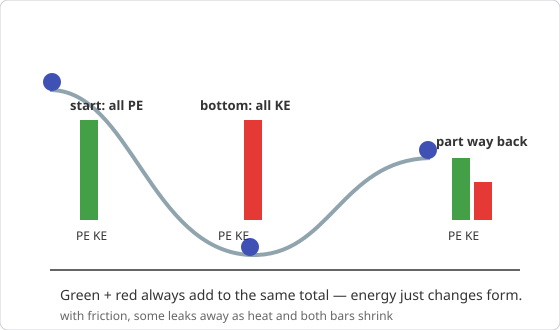
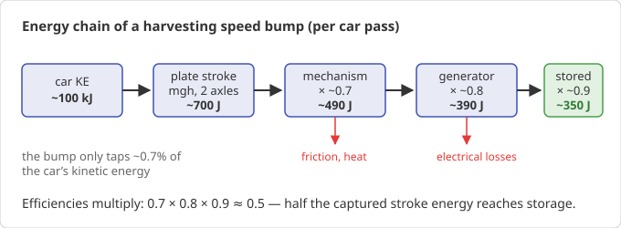

# Chapter 5 — Work, Energy, and Power

*Needs from earlier chapters: dot product (Ch. 2), Newton's laws (Ch. 4).*

Energy is the most useful bookkeeping system in physics: a single scalar
account that must always balance. This is also the chapter your speed-bump
harvester lives in.

## 5.1 Work

Work is force applied through a displacement:

    W = F · d = F d cos θ        (joules; 1 J = 1 N·m)

- Force along motion (θ=0): W = Fd, positive — energy flows *into* the object.
- Force opposing motion (θ=180°): negative work — energy flows out (friction).
- Force perpendicular to motion (θ=90°): **zero work**. The normal force on a
  rolling wheel and gravity on a horizontally moving car do no work.

**Worked example.** Push a crate 5 m with 100 N at 30° above horizontal:
W = 100 × 5 × cos 30° ≈ **433 J**.

## 5.2 Kinetic energy and the work–energy theorem

    KE = ½mv²

The work–energy theorem: **net work done on an object = its change in KE.**

    W_net = ΔKE = ½mv_f² − ½mv₀²

**Worked example.** A 1500 kg car at 50 km/h (13.9 m/s):
KE = ½ × 1500 × 13.9² ≈ **145 kJ**. At 100 km/h it's 4× that (~580 kJ) —
energy scales with v². This is the deep reason speed kills: doubling speed
quadruples the energy that must go *somewhere* in a crash.

## 5.3 Potential energy

Energy stored by position:

- **Gravitational (near Earth):** PE = mgh. Only *changes* in h matter; pick
  any convenient zero level.
- **Elastic (spring):** PE = ½kx², where k is stiffness (N/m) and x is
  compression/extension.

## 5.4 Conservation of energy

For a system with no friction-like losses ("conservative forces only"):

    KE₀ + PE₀ = KE_f + PE_f

With friction or other losses, the books still balance — you just add a loss
term (the "missing" energy becomes heat, sound, deformation):

    KE₀ + PE₀ = KE_f + PE_f + E_lost

{ style="max-width:560px" }

**Worked example — pendulum/slide.** A child slides from rest down a
frictionless 3 m high slide: mgh = ½mv² → v = √(2gh) = √(58.8) ≈ **7.7 m/s**,
regardless of the slide's shape or the child's mass.

**Worked example — the speed-bump harvester budget.** A 1500 kg car (per-axle
≈ 750 kg per wheel pair) drives over a bump whose top plate depresses
h = 5 cm under the wheel load. Energy delivered to the plate per axle:
E ≈ mgh = 750 × 9.8 × 0.05 ≈ 368 J. Two axles → ~700 J mechanical *available*
per pass, before losses. A generator chain at 20–50% overall efficiency gives
~150–350 J electrical — which is why the working figure of **50–300 J per
pass** is physically honest, and why nobody powers a neighbourhood with speed
bumps: 10,000 passes/day × ~250 J ≈ 2.5 MJ ≈ **0.7 kWh/day**, one modest
streetlight. Where does the energy come from? The car's engine — a harvesting
bump is, energetically, a very small toll.

{ style="max-width:680px" }

## 5.5 Power

Power is the *rate* of energy transfer:

    P = W/t = ΔE/Δt        (watts; 1 W = 1 J/s)

For a force pushing something at speed v: **P = Fv**. This is why a car needs
peak power at high speed (drag ∝ v², so P_drag ∝ v³) and why the same engine
climbs slowly up steep hills.

**Worked example.** Lifting 200 kg of water 10 m in 20 s:
P = mgh/t = 200×9.8×10/20 = **980 W** ≈ 1.3 horsepower (1 hp ≈ 746 W).

**Worked example — average vs peak.** Your harvester delivers ~250 J per pass.
If the pass compresses the plate in 0.2 s, *peak* power is 250/0.2 ≈ 1.2 kW —
but with one car every 10 s the *average* power is 25 W. Storage (battery or
supercap) exists exactly to bridge peaky input and steady load.

## 5.6 Efficiency

    η = useful energy out / energy in   (0–1, or %)

Efficiencies in a chain **multiply**: mechanism 70% × generator 80% ×
charge controller 90% → overall η ≈ 0.50. Long chains die fast — this is why
"how many conversion stages?" is the first question to ask of any
energy-harvesting design.

## Common pitfalls

- Counting a perpendicular force as doing work (it doesn't).
- Forgetting that KE uses v², so speeds must be in m/s before squaring.
- Treating power and energy interchangeably (a 1 kW device running 1 h uses
  1 kWh = 3.6 MJ).
- Applying pure energy conservation across a collision or friction event
  without a loss term.

## Practice problems

1. How much work does gravity do on a 2 kg book falling 1.5 m? How fast is it
   moving at the bottom (from rest)?
2. A 1000 kg car goes from 0 to 100 km/h. How much kinetic energy did it gain?
   If it took 10 s, what average power went into motion (ignore losses)?
3. A roller coaster car starts at rest 40 m up. Speed at the bottom
   (frictionless)? Speed at a second hill 15 m high?
4. A bump harvester yields 120 J per vehicle at a site with 4,000 vehicles per
   day. Average power? Daily energy in Wh? Could it run a 5 W camera 24/7?
5. A motor rated 500 W lifts a 20 kg load. Max steady lifting speed?

??? success "Answers"

    1. W = mgh = 2×9.8×1.5 = **29.4 J**; ½mv² = 29.4 → v = **5.4 m/s**.
    2. ΔKE = ½×1000×27.8² ≈ **386 kJ**; P ≈ **38.6 kW** (~52 hp — real engines
       are bigger because of drag, drivetrain losses, and non-flat torque).
    3. v = √(2g×40) = **28 m/s**; at 15 m: v = √(2g×25) = **22 m/s** (only the
       height *drop* matters).
    4. 4000×120 J = 480 kJ/day → average **5.6 W**; 480,000/3600 = **133 Wh/day**.
       A 5 W camera needs 120 Wh/day → yes, *barely*, with zero margin — you'd
       want storage plus solar top-up. (This is the arithmetic behind framing the
       product as a self-powered safety/data node, not a power plant.)
    5. P = Fv → v = 500/(20×9.8) ≈ **2.55 m/s**.

