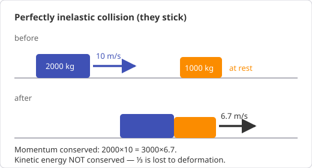
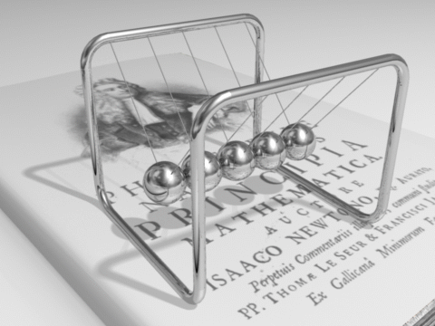

# Chapter 6 — Momentum, Impulse, and Collisions

*Needs from earlier chapters: Newton's laws (Ch. 4), energy (Ch. 5).*

## 6.1 Momentum

    p = mv        (kg·m/s; a vector)

Newton's second law in its original form: **F = Δp/Δt** — force is the rate of
change of momentum. (F = ma is the special case of constant mass.)

## 6.2 Impulse

    Impulse J = FΔt = Δp

The same momentum change can come from a big force for a short time or a small
force for a long time. This one idea explains most safety engineering:

- Airbags, crumple zones, helmet foam: **stretch Δt to shrink F**.
- A cricketer pulling their hands back while catching: same.
- Hitting a rigid wall vs a haystack: same Δp, wildly different peak force.

**Worked example.** A 1200 kg car at 15 m/s stops. Δp = 18,000 kg·m/s either
way. Against a rigid wall (Δt ≈ 0.1 s): F ≈ 180 kN. With crumple zones
(Δt ≈ 0.5 s): F ≈ 36 kN. Five times gentler, identical physics.

## 6.3 Conservation of momentum

If no *external* force acts on a system, its total momentum is constant.
Internal forces (collision forces, explosions) can't change the total — they
come in third-law pairs that cancel across the system.

    m₁v₁ + m₂v₂ = m₁v₁′ + m₂v₂′

This holds in **every** collision, elastic or not, as long as external forces
are negligible during the (brief) impact. It's a vector equation — conserve
each component.

## 6.4 Types of collision

| Type | Momentum | Kinetic energy |
|------|----------|----------------|
| Elastic | conserved | conserved |
| Inelastic | conserved | some lost (heat, deformation, sound) |
| Perfectly inelastic (stick together) | conserved | maximum loss |

**Worked example — perfectly inelastic.** A 1500 kg car at 20 m/s rear-ends a
stationary 1000 kg car; they lock together.
v′ = (1500×20)/(2500) = **12 m/s**.
KE before: 300 kJ. After: ½×2500×144 = 180 kJ. **120 kJ (40%) destroyed** —
that's the bent metal.

{ style="max-width:520px" }

**Worked example — recoil.** A 4 kg rifle fires a 10 g bullet at 800 m/s.
0 = 0.01×800 + 4×v → v = **−2 m/s** (recoil). Note the KE is wildly unequal
(bullet 3200 J, rifle 8 J) even though momenta are equal and opposite — KE
scales as p²/2m, so the light object carries almost all the energy.

*Newton's cradle: each impact hands the full momentum (and, being nearly
elastic, the full KE) down the line. Animation by DemonDeLuxe,
[Wikimedia Commons](https://commons.wikimedia.org/wiki/File:Newtons_cradle_animation_book_2.gif),
CC BY-SA 3.0.*

**Worked example — elastic special cases** (worth memorising):

- Equal masses, one at rest: they *swap* velocities (billiards).
- Heavy hits light at rest: light object flies off at ~2× the heavy one's
  speed; heavy one barely notices (car vs pedestrian — part of why 30 km/h
  zones matter).
- Light hits heavy at rest: light one bounces back at nearly the same speed.

*The first special case animated: the moving block stops dead and the target
takes over its velocity. Animation from
[Wikimedia Commons](https://commons.wikimedia.org/wiki/File:Elastischer_sto%C3%9F.gif),
CC BY-SA 2.5.*

## 6.5 Choosing energy vs momentum

- Collision or explosion, forces messy and internal → **momentum** (always
  conserved through the impact).
- Motion before/after involving heights, springs, distances → **energy**.
- Classic two-step problems (ballistic pendulum): momentum *through* the
  collision, then energy conservation *after* it. Never energy through an
  inelastic collision.

## Common pitfalls

- Conserving kinetic energy in an ordinary (inelastic) collision.
- Forgetting momentum is a vector — head-on problems need signs, 2D problems
  need components.
- Using momentum conservation while a large external force acts (e.g. during
  contact with the ground) — check the system boundary.

## Practice problems

1. A 60 kg skater at rest pushes a 40 kg skater; the lighter one moves off at
   3 m/s. How fast does the 60 kg skater move, and which way?
2. A 0.15 kg ball hits a wall at 20 m/s and rebounds at 15 m/s. Contact time
   0.01 s. Find the impulse and the average force.
3. A 2000 kg truck at 10 m/s hits a stationary 1000 kg car; they couple.
   Common speed? Fraction of KE lost?
4. A 10 g bullet at 400 m/s embeds in a 2 kg block hanging from strings. How
   high does the block swing? (Two-step: momentum, then energy.)

??? success "Answers"

    1. 60v = −40×3 → v = **2 m/s backwards**.
    2. Δp = 0.15×(−15 − 20) = **−5.25 kg·m/s** (toward the wall = positive
       convention); F = 5.25/0.01 = **525 N**.
    3. v′ = 20000/3000 = **6.67 m/s**. KE: 100 kJ → 66.7 kJ, so **⅓ lost**.
    4. Momentum: v′ = (0.01×400)/2.01 ≈ 1.99 m/s. Energy: h = v′²/2g ≈ **0.20 m**.
       (Doing this with energy conservation through the impact gives 8 m — off by
       40× — because ~99.5% of the bullet's KE is destroyed in the wood.)

