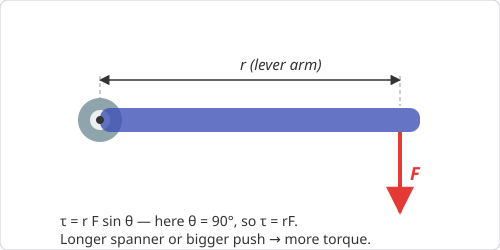
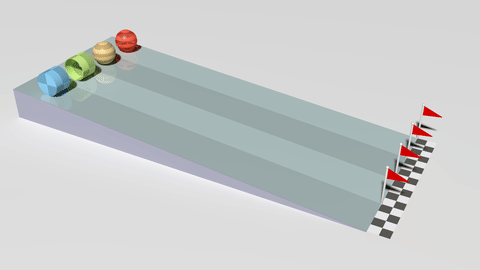

# Chapter 7 — Rotation

*Needs from earlier chapters: everything so far — rotation replays the whole
course with angular quantities.*

## 7.1 The translation dictionary

Every linear quantity has a rotational twin. Learn the dictionary and you
already know the equations:

| Linear | Rotational | Link |
|--------|------------|------|
| position x | angle θ (radians) | x = rθ |
| velocity v | angular velocity ω (rad/s) | v = rω |
| acceleration a | angular acceleration α (rad/s²) | a = rα |
| mass m | moment of inertia I | depends on shape |
| force F | torque τ | τ = rF sin θ |
| F = ma | τ = Iα | |
| KE = ½mv² | KE_rot = ½Iω² | |
| p = mv | L = Iω | |

Radians are mandatory: 1 revolution = 2π rad; 360° = 2π. Angular speed from
rpm: ω = rpm × 2π/60.

The constant-α kinematics equations are the suvat set with letters swapped:
ω = ω₀ + αt, Δθ = ω₀t + ½αt², ω² = ω₀² + 2αΔθ.

## 7.2 Torque

    τ = r F sin θ  = (lever arm) × (force)

Torque is the "turning effectiveness" of a force: bigger force, longer lever
arm, or more perpendicular push → more turning. Units N·m (not joules, even
though dimensionally identical — torque isn't energy).

Everyday check: you push a door at the handle, not the hinge, and
perpendicular to the door, not along it.

{ style="max-width:500px" }

**Worked example.** Tightening a bolt with a 0.3 m spanner, pushing 50 N
perpendicular: τ = 0.3 × 50 = **15 N·m**. Slip a pipe over the spanner to
double its length → double the torque for the same push.

## 7.3 Moment of inertia

I measures resistance to *angular* acceleration. Unlike mass, it depends on
**where** the mass sits: farther from the axis counts more (as r²).

    I = Σ m r²

| Shape (axis through centre) | I |
|------------------------------|---|
| Point mass at radius r | mr² |
| Hoop / thin ring | mr² |
| Solid disc / cylinder | ½mr² |
| Solid sphere | (2/5)mr² |
| Rod, axis through centre | (1/12)mL² |
| Rod, axis through end | (1/3)mL² |

Intuition: a figure skater pulling arms in reduces I; a flywheel wants its
mass at the rim (maximise I for energy storage — relevant if a harvester
design ever uses a flywheel to smooth its peaky input).

## 7.4 Rolling

A wheel rolling without slipping obeys v = rω, and its kinetic energy has two
parts:

    KE = ½mv² + ½Iω²

*The rolling race, animated: the object with the smallest I relative to mr²
(the solid ball) wins; the hollow hoop-like shell comes last.
[Wikimedia Commons](https://commons.wikimedia.org/wiki/File:Rolling_Racers_-_Moment_of_inertia.gif),
public domain.*

**Worked example — the rolling race.** Roll a hoop, a disc, and a solid sphere
down the same ramp. The sphere wins, hoop loses, *regardless of mass or
radius*: more of the hoop's energy budget is tied up in rotation
(I is larger relative to mr²), leaving less for forward speed.
For a disc from height h: mgh = ½mv² + ½(½mr²)(v/r)² = ¾mv² →
v = √(4gh/3), about 82% of the frictionless-slide speed.

## 7.5 Angular momentum

    L = Iω

Conserved when no external torque acts. The skater spin: pulling arms in
halves I → ω doubles (and rotational KE goes *up* — the skater's muscles do
work). Same principle: a diver tucking, a star collapsing into a fast-spinning
neutron star, a helicopter needing a tail rotor.

## 7.6 Static equilibrium

An object at rest needs **both** balances:

    ΣF = 0   and   Στ = 0  (about any point you like)

Pick the pivot cleverly — put it where an unknown force acts, and that force
drops out of the torque equation.

**Worked example — the plank.** A 4 m, 20 kg plank rests on two supports at
its ends; a 60 kg person stands 1 m from the left end. Torques about the left
support: R_right × 4 = 20g × 2 + 60g × 1 → R_right = (392 + 588)/4 = 245 N.
Then ΣF = 0 gives R_left = (80×9.8) − 245 = **539 N**.

## Common pitfalls

- Degrees in formulas that need radians (v = rω, arc length, α equations).
- Using the wrong lever arm: it's the *perpendicular* distance from axis to
  the force's line of action.
- Forgetting rolling objects carry rotational KE (energy conservation
  answers come out too fast if you drop it).
- Treating I as fixed for a body — it changes when the axis changes.

## Practice problems

1. A grinding wheel accelerates from rest to 3000 rpm in 5 s. Find α and the
   number of revolutions made.
2. A 2 kg solid disc of radius 0.5 m spins at 10 rad/s. Its rotational KE?
   Its angular momentum?
3. Two children on a seesaw: 30 kg at 2 m from the pivot. Where must a 40 kg
   child sit to balance?
4. A solid sphere rolls (without slipping) from rest down a 2 m high slope.
   Speed at the bottom? Compare with a frictionless sliding block.
5. A skater with I = 4 kg·m² spins at 2 rev/s, then pulls arms in to
   I = 2 kg·m². New spin rate? Factor change in rotational KE?

??? success "Answers"

    1. ω = 3000×2π/60 = 314 rad/s; α = **62.8 rad/s²**; Δθ = ½αt² = 785 rad =
       **125 revolutions**.
    2. I = ½×2×0.25 = 0.25 kg·m²; KE = ½×0.25×100 = **12.5 J**; L = **2.5 kg·m²/s**.
    3. 30×2 = 40×d → d = **1.5 m**.
    4. mgh = ½mv² + ½(2/5 mr²)(v/r)² = (7/10)mv² → v = √(10gh/7) ≈ **5.3 m/s**;
       sliding block: √(2gh) ≈ 6.3 m/s.
    5. L conserved: ω doubles → **4 rev/s**; KE = L²/2I doubles → **×2** (work
       done by the skater's arms).

