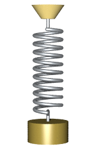
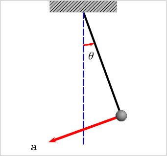
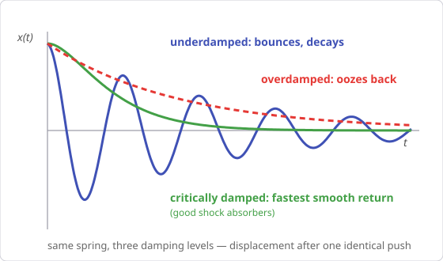
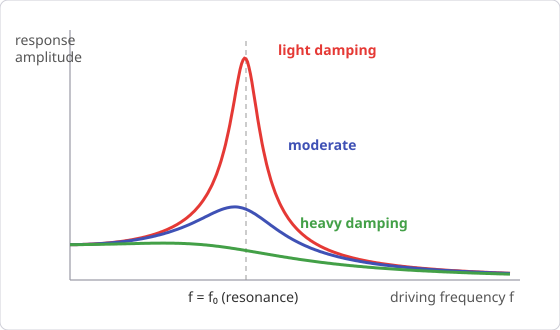

# Chapter 8 — Oscillations

*Needs from earlier chapters: Newton's laws (Ch. 4), energy (Ch. 5).*

Anything with a stable equilibrium and a restoring force oscillates when
disturbed: springs, pendulums, guitar strings, buildings in wind, car
suspensions crossing speed bumps. One mathematical pattern covers them all.

## 8.1 Hooke's law and simple harmonic motion (SHM)

A spring pushes back proportionally to how far you stretch it:

    F = −kx

k is stiffness (N/m); the minus sign says the force always points back toward
equilibrium. Newton's second law then gives motion of the form:

    x(t) = A cos(ωt + φ)

- **A** — amplitude: maximum displacement.
- **ω** — angular frequency (rad/s): ω = √(k/m) for a mass on a spring.
- **φ** — phase: where in the cycle it starts.
- Period **T = 2π/ω = 2π√(m/k)**; frequency f = 1/T (Hz).

The defining signature of SHM: **the period does not depend on amplitude.**
Small push or big push, same T (as long as the restoring force stays
proportional to displacement).

*A mass on a spring in SHM. Animation by Svjo,
[Wikimedia Commons](https://commons.wikimedia.org/wiki/File:Animated-mass-spring.gif),
CC BY-SA 3.0.*

Velocity and acceleration follow by pattern: v_max = ωA (at the centre),
a_max = ω²A (at the extremes, where x is largest).

## 8.2 Energy in SHM

Energy sloshes between kinetic and spring potential, total constant:

    E = ½kA² = ½mv_max²

All potential at the extremes, all kinetic at the centre.

**Worked example.** A 0.5 kg mass on a k = 200 N/m spring, pulled 10 cm and
released. ω = √(200/0.5) = 20 rad/s, T ≈ 0.31 s.
E = ½ × 200 × 0.01 = 1 J. v_max = ωA = **2 m/s**.

## 8.3 The pendulum

For small swings (≲15°), a pendulum of length L is SHM with:

    T = 2π√(L/g)

*A swinging pendulum with its acceleration vector. Animation from
[Wikimedia Commons](https://commons.wikimedia.org/wiki/File:Oscillating_pendulum.gif),
CC BY-SA 3.0.*

Independent of mass *and* (for small angles) amplitude — which is why
pendulum clocks worked. Note the twin: spring T uses m/k, pendulum uses L/g.

**Worked example.** A 1 m pendulum: T = 2π√(1/9.8) ≈ **2.0 s**. This also
gives a way to *measure g*: time 20 swings, get T, solve g = 4π²L/T².

## 8.4 Damping

Real oscillators lose energy (friction, drag) and the amplitude decays:

- **Underdamped**: oscillates with shrinking amplitude (guitar string).
- **Critically damped**: returns to equilibrium fastest with no overshoot —
  the design target for car suspensions and door closers.
- **Overdamped**: oozes back slowly, no oscillation.

{ style="max-width:560px" }

A car with worn shock absorbers is underdamped: hit a bump and it bounces
several times. The "push down on the bonnet" test checks exactly this — one
smooth return means damping is near critical.

## 8.5 Driven oscillations and resonance

Push an oscillator periodically and the response depends on how the driving
frequency f compares with the natural frequency f₀ = (1/2π)√(k/m):

- f ≪ f₀ or f ≫ f₀: small response.
- **f ≈ f₀: resonance** — amplitude grows dramatically, limited only by
  damping.

{ style="max-width:560px" }

Resonance breaks things (soldiers breaking step on bridges, the Tacoma
Narrows collapse, a glass shattered by sound) and makes things work (radio
tuning, musical instruments, microwave ovens).

**Worked example — why speed bumps have a design speed.** A car's suspension
is a mass-spring-damper with natural frequency ≈ 1–1.5 Hz. Bumps spaced d
apart excite it at f = v/d. With d = 10 m, resonance at v ≈ 10–15 m/s
(36–54 km/h) — deeply uncomfortable — while at crawling speed the excitation
is far below f₀ and the ride is calm. Bump geometry + spacing effectively
*tunes* the discomfort to punish speeding. (For a harvesting bump, the flip
side matters too: how fast the plate is hit sets your input pulse shape, and
your mechanism's own resonance sets how well it converts it.)

## Common pitfalls

- Using the pendulum formula for big swings (it's a small-angle
  approximation).
- Thinking heavier pendulum = slower swing. Mass cancels; only L and g matter.
- Confusing ω (rad/s) with f (Hz): ω = 2πf.
- Maximum speed is at the *centre*, maximum acceleration at the *extremes* —
  students regularly swap these.

## Practice problems

1. A 2 kg mass stretches a vertical spring 4 cm at rest. Find k, then the
   period if it's set bouncing.
2. What pendulum length gives T = 1 s?
3. A mass on a spring oscillates with A = 5 cm and f = 2 Hz. Find v_max and
   a_max.
4. An SHM system has E = 0.5 J and k = 100 N/m. Amplitude? Speed at x = A/2
   if m = 0.25 kg?
5. A car (1200 kg on 4 springs, effective k_total = 48 kN/m) crosses bumps
   spaced 8 m apart. At what speed does it resonate?

??? success "Answers"

    1. k = mg/x = 2×9.8/0.04 = **490 N/m**; T = 2π√(2/490) ≈ **0.40 s**.
    2. L = gT²/4π² = 9.8/39.5 ≈ **0.25 m**.
    3. ω = 2πf = 12.57 rad/s; v_max = ωA = **0.63 m/s**; a_max = ω²A =
       **7.9 m/s²** (~0.8 g).
    4. A = √(2E/k) = **0.1 m**. At x = A/2: PE = ½k(A/2)² = 0.125 J, so
       KE = 0.375 J → v = √(2×0.375/0.25) ≈ **1.73 m/s**.
    5. f₀ = (1/2π)√(48000/1200) = (1/2π)×6.32 ≈ 1.0 Hz. Resonance at v = f₀×d =
       **8 m/s ≈ 29 km/h** — right in the range drivers actually use, which is
       the point.

