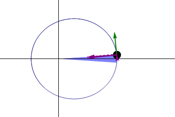

# Chapter 9 — Gravitation

*Needs from earlier chapters: circular motion (Ch. 4), energy (Ch. 5).*

## 9.1 Newton's law of universal gravitation

Every pair of masses attracts:

    F = G m₁m₂ / r²

with G = 6.67 × 10⁻¹¹ N·m²/kg², and r the distance between *centres*.
Gravity is astonishingly weak — two 1000 kg cars a metre apart attract with
~7 × 10⁻⁵ N — it only dominates because planets are enormous and gravity
never cancels (no negative mass).

**Inverse square** is the key structure: double the distance, quarter the
force. (The same law shape governs light intensity and electric force.)

## 9.2 Where g comes from

Your weight is just the universal law applied to you and Earth:

    g = GM_earth / R_earth² = 6.67e−11 × 5.97e24 / (6.37e6)² ≈ 9.8 m/s²

So g isn't fundamental — it's a local value. On the Moon
(M smaller, R smaller): g_moon ≈ 1.6 m/s². At 400 km altitude (the ISS):
g ≈ 8.7 m/s² — nearly full strength. Astronauts float not because gravity is
absent but because they are in continuous free fall *around* the Earth.

*Newton's cannonball thought experiment: fired fast enough (~7.3 km/s), the
projectile falls around the Earth forever — that's an orbit. Animation from
[Wikimedia Commons](https://commons.wikimedia.org/wiki/File:Newtonsmountainv%3D7300.gif),
CC BY-SA 3.0.*

## 9.3 Orbits

A circular orbit is the case where gravity exactly supplies the needed
centripetal force:

    GMm/r² = mv²/r   →   v = √(GM/r)

Consequences:
- Orbital speed doesn't depend on the satellite's mass.
- Lower orbits are *faster* (ISS: ~7.7 km/s, ~90 min per lap).
- Period: T = 2π√(r³/GM) — this is **Kepler's third law** (T² ∝ r³).
- A geostationary orbit (T = 24 h) works out to r ≈ 42,000 km from Earth's
  centre — where communications and GPS-adjacent satellites sit.

**Worked example.** Find the ISS orbital speed (r ≈ 6.77 × 10⁶ m):
v = √(6.67e−11 × 5.97e24 / 6.77e6) ≈ **7.7 km/s** ≈ 27,600 km/h.

## 9.4 Gravitational potential energy, properly

PE = mgh is a near-surface approximation. The general form (zero at infinity):

    PE = −GMm/r

Negative because you're *bound*: it takes energy to climb out. The energy to
fully escape from the surface gives the **escape velocity**:

    v_esc = √(2GM/R)   ≈ 11.2 km/s for Earth

Note v_esc = √2 × orbital speed at the surface, and it doesn't depend on the
projectile's mass.

## 9.5 Kepler's laws (summary)

1. Orbits are ellipses with the Sun at one focus.
2. A planet sweeps equal areas in equal times (fast near the Sun, slow far
   away — this is conservation of angular momentum, Ch. 7).
3. T² ∝ r³ (derived above for circles; holds for ellipses with r = semi-major
   axis).

*Kepler's second law animated: the sweeping segment covers equal areas in
equal times, so the planet moves fastest at closest approach. Animation from
[Wikimedia Commons](https://commons.wikimedia.org/wiki/File:Kepler-second-law.gif),
CC BY-SA 3.0.*

## Common pitfalls

- Using surface-to-surface distance instead of centre-to-centre r.
- Thinking orbiting = no gravity. Orbiting *is* falling.
- Using PE = mgh for altitude changes that aren't small compared to Earth's
  radius.
- Confusing G (universal constant) with g (local surface acceleration).

## Practice problems

1. How does your weight change at altitude equal to one Earth radius
   (r = 2R)?
2. Compute g on Mars: M = 6.42 × 10²³ kg, R = 3.39 × 10⁶ m.
3. A satellite orbits at r = 7 × 10⁶ m. Find its speed and period.
4. Using Kepler's third law and the Moon's orbit (r ≈ 3.84 × 10⁸ m,
   T ≈ 27.3 days), estimate Earth's mass.

??? success "Answers"

    1. Force ∝ 1/r² → weight drops to **¼** of surface value.
    2. g = GM/R² = 6.67e−11 × 6.42e23 / 1.15e13 ≈ **3.7 m/s²**.
    3. v = √(GM/r) ≈ **7.5 km/s**; T = 2πr/v ≈ 5,850 s ≈ **97 min**.
    4. M = 4π²r³/(GT²) = 4π² × (3.84e8)³ / (6.67e−11 × (2.36e6)²) ≈
       **6.0 × 10²⁴ kg** — matches the accepted value.

